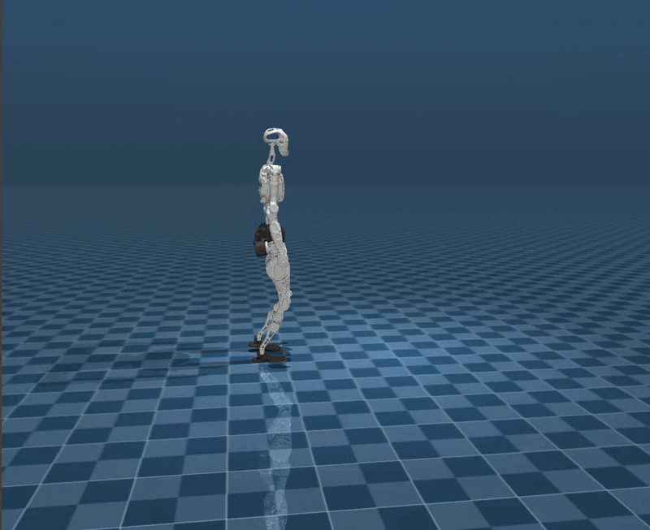

# PND RL Mjlab


## ✳️ Overview
PND RL Mjlab is a reinforcement learning project built upon the
[mjlab](https://github.com/mujocolab/mjlab.git), using MuJoCo as its 
physics simulation backend, currently supporting PND Adam SP.

Mjlab combines [Isaac Lab](https://github.com/isaac-sim/IsaacLab)'s proven API
with best-in-class [MuJoCo](https://github.com/google-deepmind/mujoco_warp)
physics to provide lightweight, modular abstractions for RL robotics research
and sim-to-real deployment.

<div align="center">

| <div align="center">  MuJoCo </div>                                                                                                                                           | <div align="center"> Physical </div>                                                                                                                                               |
|-------------------------------------------------------------------------------------------------------------------------------------------------------------------------------|------------------------------------------------------------------------------------------------------------------------------------------------------------------------------------|
| <div style="width:250px; height:150px; overflow:hidden;"></div> | <div style="width:250px; height:150px; overflow:hidden;"></div> |

</div>


## 📦 Installation and Configuration

Please refer to [setup.md](doc/setup_en.md) for installation and configuration steps.


## 🔁 Process Overview

The basic workflow for using reinforcement learning to achieve motion control is:

`Train` → `Play` → `Sim2Real`

- **Train**: The agent interacts with the MuJoCo simulation and optimizes policies through reward maximization.
- **Play**: Replay trained policies to verify expected behavior.
- **Sim2Real**: Deploy trained policies to physical Adam SP robots for real-world execution.


## 🛠️ Usage Guide

### 1. Velocity Tracking Training

Run the following command to train a velocity tracking policy:

```bash
python scripts/train.py Mjlab-Velocity-Flat-Adam-SP --env.scene.num-envs=4096
```

Multi-GPU Training: Scale to multiple GPUs using --gpu-ids:

```bash
python scripts/train.py Mjlab-Velocity-Flat-Adam-SP \
  --gpu-ids 0 1 \
  --env.scene.num-envs=4096
```

- The first argument (e.g., Mjlab-Velocity-Flat-Adam-SP) specifies the training task.
Available velocity tracking tasks:
  - Mjlab-Velocity-Flat-Adam-SP


> [!NOTE]
> For more details, refer to the mjlab documentation:
> [mjlab documentation](https://mujocolab.github.io/mjlab/index.html).

### 2. Motion Imitation Training

Train a Adam SP to mimic reference motion sequences.

<div style="margin-left: 20px;">

#### 2.1 Prepare Motion Files

Prepare csv motion files in mjlab/motions/adam_sp/ and convert them to npz format:

```bash
python scripts/csv_to_npz.py \
--input-file mjlab/motions/adam_sp/dance1_subject2.csv \
--output-name dance1_subject2.npz \
--input-fps 30 \
--output-fps 50
```

**npz files will be stored at:**：`mjlab/motions/adam_sp/...`

#### 2.2 Training

After generating the NPZ file, launch imitation training:

```bash
python scripts/train.py Mjlab-Tracking-Flat-Adam-SP --motion_file=mjlab/motions/adam_sp/dance1_subject2.npz --env.scene.num-envs=4096
```

</div>

> [!NOTE]
> For detailed motion imitation instructions, refer to the BeyondMimic documentation:
> [BeyondMimic documentation](https://github.com/HybridRobotics/whole_body_tracking/blob/main/README.md#motion-preprocessing--registry-setup).

#### ⚙️  Parameter Description
- `--env.scene`: simulation scene configuration (e.g., num_envs, dt, ground type, gravity, disturbances)
- `--env.observations`: observation space configuration (e.g., joint state, IMU, commands, etc.)
- `--env.rewards`: reward terms used for policy optimization
- `--env.commands`: task commands (e.g., velocity, pose, or motion targets)
- `--env.terminations`: termination conditions for each episode
- `--agent.seed`: random seed for reproducibility
- `--agent.resume`: resume from the last saved checkpoint when enabled
- `--agent.policy`: policy network architecture configuration
- `--agent.algorithm`: reinforcement learning algorithm configuration (PPO, hyperparameters, etc.)

**Training results are stored at**：`logs/rsl_rl/<robot>_(velocity | tracking)/<date_time>/model_<iteration>.pt`

### 3. Simulation Validation

To visualize policy behavior in MuJoCo:

Velocity tracking:
```bash
python scripts/play.py Mjlab-Velocity-Flat-Adam-SP --checkpoint_file=logs/rsl_rl/adam_sp_velocity/2026-xx-xx_xx-xx-xx/model_xx.pt
```

Motion imitation:
```bash
python scripts/play.py Mjlab-Tracking-Flat-Adam-SP --motion_file=mjlab/motions/adam_sp/dance1_subject2.npz --checkpoint_file=logs/rsl_rl/adam_sp_tracking/2026-xx-xx_xx-xx-xx/model_xx.pt
```

**Note**：

- During training, policy.onnx and policy.onnx.data are also exported for deployment onto physical robots.

For a **Python-based** FSM (passive, fixed pose, locomotion, Beyond Mimic) in MuJoCo or on-robot DDS, see **[deploy/README.md](deploy/deploy_real/README.md)** and **Section 4.1** below.

### 4. Deployment

#### 4.1 Python control stack (`deploy/`)

This repository includes a Python deploy package under **`deploy/`**: a finite-state machine switches between passive mode, fixed-pose interpolation, TorchScript locomotion, and ONNX Beyond Mimic. Per-policy settings live in `deploy/policy/*/config/*.yaml`.

**MuJoCo (simulation)** — requires `mujoco`, `numpy`, `pyyaml`, and policy deps (`torch` / `onnxruntime` as needed):

```bash
cd deploy
python deploy_mujoco/deploy_mujoco.py
```

- Scene and timing: `deploy/deploy_mujoco/config/mujoco.yaml` (`xml_path` is relative to the **`deploy/`** directory).
- Keyboard: `7` / `8` adjust hoist height, `9` toggles suspension force; standing policies disable suspension so the character does not float.

**Gamepad (simulation)**:

| Input | Action |
|--------|--------|
| **B** release | Passive |
| **START** release | Fixed pose (blend to default angles) |
| **A** + **RB** held | Passive |
| **A** release | Beyond Mimic (needs motion `.npz` + ONNX under `deploy/policy/adam_beyond_mimic/`) |
| **Y** release | Locomotion |
| **SELECT** press | Quit |
| Sticks | Velocity commands (locomotion) |

**Real robot (DDS)** — requires the [pnd_sdk_python](https://github.com/pndbotics/pnd_sdk_python) and DDS network settings in `deploy/deploy_real/config/real.yaml`:

```bash
cd deploy
python deploy_real/deploy_real.py {net_interface}
```

**Remote / DDS notes** ( see **[deploy/README.md](deploy/deploy_real/README.md)** for systemd examples and full tables):

- Enter control after pressing **L0 + R0** on the D-pad (mapping details: `deploy/common/remote_controller.py`).
- **START**: fixed pose · **A**: Beyond Mimic · **Y**: locomotion · **B** / **A+RB**: passive · **SELECT**: exit loop.

**Swap models or motion**: place weights in the policy’s `deploy/policy/<name>/model/` and update `policy_path` / `motion_path` in that policy’s YAML; adjust `num_actions` and observation code if dimensions change.


</div>


## 🎉  Acknowledgements

This project would not be possible without the contributions of the following repositories:

- [mjlab](https://github.com/mujocolab/mjlab.git): training and execution framework
- [whole_body_tracking](https://github.com/HybridRobotics/whole_body_tracking.git): versatile humanoid motion tracking framework
- [rsl_rl](https://github.com/leggedrobotics/rsl_rl.git): reinforcement learning algorithm implementation
- [mujoco_warp](https://github.com/google-deepmind/mujoco_warp.git): GPU-accelerated rendering and simulation interface
- [mujoco](https://github.com/google-deepmind/mujoco.git): high-fidelity rigid-body physics engine
